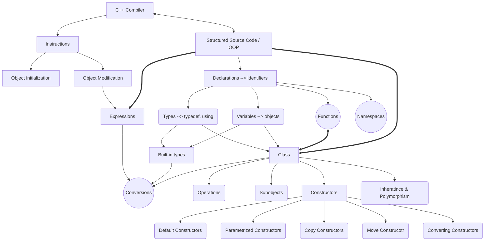

Author: **Petar Brankovic**  
*School of Electrical Engineering* | **ETF**  
Class: **Object Oriented Programming 1**

# Table of Contents

- [Principles of OOP](#principles-of-oop)
  - [Modularity](#modularity)
  - [Encapsulation](#encapsulation)
  - [Classes](#classes)
  - [Inheritance](#inheritance)
  - [Polymorphism](#polymorphism)
  - [Generic class](#generic-class)
  - [Abstraction](#abstraction)
  - [Model-based software engineering](#model-based-software-engineering)
  - [Threads](#threads)
  - [Software architecture characteristics](#software-architecture-characteristics)
  - [Distribution of responsibility](#distribution-of-responsibility)
  - [Algorithmic decomposition](#algorithmic-decomposition)
  - [Relations and dependencies between classes](#relations-and-dependencies-between-classes)
  - [Class encapsulation](#class-encapsulation)
  - [Hiearchical decomposition](#hiearchical-decomposition)

- [C++](#c)
  - [Objects](#objects)
  - [Types](#types)
  - [Type specifications](#type-specifications)
  - [Literals](#literals)
  - [Conversions](#conversions)
  - [Declarations](#declarations)
  - [Scope](#scope)
  - [Namespaces](#namespaces)
  - [Functions](#functions)
  - [Inline functions](#inline-functions)
  - [Expressions](#expressions)
  - [Initialization](#initialization)
  - [Exception handling](#exception-handling)
  - [Classes](#classes-1)
  - [Class constructors](#class-constructors)
  - [Class overloaded operators](#class-overloaded-operators)
  - [Class inheritance](#class-inheritance)
  - [Class expressions](#class-expressions)

- [My mindmap (essence of C++ statements)](#my-mindmap-essence-of-c-statements)

# Principles of OOP

## Modularity

Modularity is a way of breaking down a complex problem or system into smaller logical units (**modules**) that:

- Have a **clearly defined responsibility**.
- Can be **developed, tested, and changed independently**.
- Have **minimal interdependence**.

Benefits that modular program brings are: **Readability**, **Reusability**, Easier **Testing** & **Debugging**, **Scalability**.

In programming, modularity is achieved by **decomposition** through:

- Functions and procedures
- Classes and objects 
- Packages, modules, and namespaces

## Encapsulation

**Encapsulation** is a technique designed to prevent other parts of program or users to accidentally disturb and break modules functionality while using it or to rely on some informations and assumptions about its implemenation that might be changed.

It is achieved by using the principle of **information hiding** that says that every module should have clearly defined:

- **Interface**: Specification of elements (structures, types, operations) that other parts of program can see and rely on.
- **Implementation**: Intern parts (structure, behaviour) that other parts of program can't see and rely on assumptions about it.

In **C** it is usually done by spliting the module in one **header file (.h)** which makes interface, and one **(.c) file** that has implementation.

## Classes

A class, at its core, is an abstarction that groups together a **structure** (data) and **behaviours** (operations over that structure) into a single logical unit.

**Objects**, basically, are instances of the structure that holds data (**attributes**) of the given class. Each (non-static) function member (**method**) of that class is implemented as a regular function with added first hidden argument that points to the object invoking it.

Classes support encapsulation by defining which class members are **private**, which **protected**, and which are **public**.

Classes support concept of **constructors** (and **destructors**) which allow you to control how objects are initialized (destroyed). They are implemented as a class member function, with the same name as the function, which defines how object is initialized

## Inheritance

**Inheritance** is a mechanism designed to allow adding new features to a class without modifying it.

It is achieved through creating a new **child** class that *inherits* all features (*atributes, methods*) from original **parent** class, and then *specializing* or *extending* it by adding new features (*atrbiutes, methods*) that base class doesen't have.

Object of the derived class has built-in *subobject* of the base class, which is used in **Substitution rule** that says: wherever and whenever object of the base class is expected, a object of the derived class can be used.

When the object of the derived class is created, before executing its own constructor, the constructor of the base class is called first creating the **subobject**.

## Polymorphism

Principle of **polymorphism** is designed to allow changing the implementation of class behaviours (*methods*) so they can support newly added features.

It is achieved through defining class functions as **virtual** which allows derived classes of that class to redefine them and change its implementation.

For every class that has at least one virtual function, compiler generates a structure, table of virtual functions (**Virtual Table**) that holds pointers to implementations of virtual functions that correspond to that class.

Now in every object there is a pointer that points to a table of virtual functions (**Virtual Table Pointer**). Constructor initializes this pointer to point to a virtual table of a class that corresponds to that constructor.

So every call of virtual function is done by **dynamic binding**, by indirect access through virtual table pointer of that object, then pointer in virtual table to the function that corresponds to the virtual function of that class.

## Generic class

Concept of **generic classes** is designed to allow defining structures (classes) with arbitrary data types. Data types are given as parameters when declaring object.

They are just pure **automatization**. The effect is same as writing separate classes for each data type, these generic classes are different one from another, they are just generated on demand by compiler when used for the first time with concrete data types.

## Abstraction

**Abstraction** is a process where we ignore non-relevant details and behaviours of things, that are not important for solution, in order to simplify them enough so they become solvable and realizable.

Part of abstraction is also **generalization** where we ignore differences between things we need, in order to group them in generalized abstraction to achieve better simplification. We use **specialization** to define each things uniqueness that we need from them.

It is used as base tool, alongside decomposition, in a fight against **complex problem domains** that we try to solve, and in **modeling** real world phenomenons, systems and entities.

We use **classes** to represent abstractions from real world or logic concepts from problem domain, and its generalizations and specializations.

## Model-based software engineering

When we want to create classes whose behaviours depend a lot on objects current **state**, then the code could get pretty complex with a lot of branching to process every state and more susceptible to errors.

The solution that classic OOP languages do not support, is modeling objects behaviour using **state machines** and generating code from that model (***model-based software engineering***).

## Threads

If we have behaviours that need to execute parallelly, creating elementary steps for each of them and cycling between them in infinite while loop can create huge unnecessary complexity, so we implement behaviour of active objects as **threads**.

Each thread has its own sequence of instructions (***control flow***), that includes its own automatic variables and call stack. Operating system regulates thread parallel processing.

## Software architecture characteristics

**Bad** software characteristics:
- **Rigidity**: Parts of software are too much mutually dependent, so they become hard to change. Every change in one part requires changes in other parts.
- **Fragility**: Caused by a lot of intertwining, problems in one part causes a lot of problems in other parts - **domino effect**.
- **Immobility**: Parts of one app are hard to use in another, because of huge interdependency with other parts.

So software with **good** characteristics is:
- **Flexible**: Easy to maintain (*modify & extend*).
- **Robust**: Resistant to changes, they dont affect its correctness.
- **Portable & Reusable**: Parts are easily implemented in another app.

And it is achieved by:
- Clear, simple, correct, understandable and flexible **architecture**.
- Real **abstractions** and good **distribution of responsibility**.
- **Modularity** and **Encapsulation**
- **Weak interdependency** between parts (*abstraction, modules*), simple **interfaces**.

## Distribution of responsibility

Good distribution of responsibility among abstractions, classes, modules is achieved by grouping elements of software (*data, functionalities*) by principle of **strong cohesion & loose coupling**:
- Elements inside the same class or module should be strongly and tightly interconnected (***cohesion***).
- Elements of different classes and modules should ideally just know interfaces of each other, not their internal details (***loose coupling***).

It is similar to the **single responsibility principle**: Classes should have limited responsibility, so there would exist only one reason for their modification.

One of the ways to achieve better software characteristics is by using **localization of design decisions** by keeping each design decision in one place, not scattering it throughout the program. 

## Algorithmic decomposition

In the center of attention of algorithmic decomposition is the task that needs to be done, for which we define **procedure** for its execution.

Initially the procedure is divided in **steps**, of high level of granularity and abstraction. Then every step is divided in more smaller steps until we reach lowest levels of granularity, the one where we can express it with elemental construct of programming language we use.

When to **decompose**:
- **Too much code**: When implementation of procedure has too much code, it becomes hard to read, follow and understand. General rule: If it has more than 15-20 lines of code you should think of decomposing it more.
- **Too much nesting**: When there is too much branching (*if-then-else*) or loops (*for, while*). General rule: It isn't good to have more then 2 levels of nesting, becomes hard to read and understand.
- **Reusable parts**: When some parts of implementation of one operation are used in other operations, to avoid code duplication. *Copy-paste* is a very bad practise in programming because it leads to a lot of errors and mistakes.

Procedures are also product of **abstraction**, where for every step we care only about its interface, we delay their implementation and details for later.

In OOP algorithmic decomposition also has an important role, but not central anymore like in procedural programming, so it is one of main elements in **object decomposition**. 

We still use it for decomposing procedures, but for every step, we define an **agent** (*abstraction, class*) that is responsible for its execution.

When we decompose a method (*operation*) of some class in to steps, we can **delegate responsibility** of those steps to some other class, or we can keep them and implement in the current class as **helper** methods.

These helper methods should usually be protected, as they probably aren't part of interface, but could probably be used in implementation of other operations in derived classes. If we make them virtual and allow polymorphism, then we can change their implementation and behaviour of original operation in base class which can be useful sometimes. These virtual helper functions are called **hook** methods.

## Relations and dependencies between classes

Our class (**client**), in order to fulfill its responsibility, often wants to use services (*operations*) of other classes (**servers**).

To do that, client has to have a structural **link** with server. In OOP, it is achieved by having pointer/reference to the object of the class we want use.

Links between classes don't have to be used only for calling operations. It can represent a simple connection between objects, to define that they are in conceptual **relation**, which can be used as data.

Instead of letting object-client create the needed objects-server by himself, the practise shows that it's better to let someone who uses the class, from outside, **inject dependency** by passing as the object-server that the client uses, as argument in constructor, setter, or method directly.

## Class encapsulation

The order of declaring class members, for increased readability:
1. **Public**: Interface, only what is needed by the most users.
2. **Protected**: Specific interface, for priviliged users.
3. **Private**: Implementation, it should be hidden, only for the designers of the class.

Recommended distribution of class members:
- **Public**: Only methods (*operations*) that are part of interface.
- **Protected**:
    - Getters & Setters that are not part of interface, but are needed for derived classes to access data members.
    - Helper and hook methods, because they are often needed in child classes.
- **Private**: All data members exclusively, so their access can be more easily controlled and manipulated. If access is needed make getters & setters. 

If we want to store data that is not property of a single object, but a class as a whole, instead of defining it globally available which would break encapsulation, we define it as **static data member**. There exists only one instance for every static data member, shared between all objects of that class.

Similarly, if there are services requested from a class as whole, not concrete objects, we can define **static member function**, and they do not have pointer to the object that is invoking them.

## Hiearchical decomposition

**Hiearchical decomposition** is another element of object decomposition and it implies creating hiearchy of classes connected with relation of inheritance. It uses generalization and specialization as base tool.

To avoid modifying existing parts of software, which is usually the main source of rigidity and domino effects, we use **open-closed principle**. Every class/module should be closed for changes, but open for extensions and redefining which is usually achieved with inheritance and polymorphism.

Because of this all operations should be defined by default **virtual**, and to remove possibilites of error and improve readability, a keyword **override** to imply that the function is being redefined.

In special cases some virtual operations should be closed for redefining and some classes should be closed for inheriting, and that is done by declaring them **final**.

Base motive for **generalization** is that some other part of software (client) wants to observe and use instances of different specialized classes as if they are the same, through generalized interface, not making difference between them.

**Abstract class** is a generalized class that won't have it's own direct instances, only indirect, because it doesen't have its own implementation of operations that need to be polymorphed. Using them we make software more loosely coupled, and clients of the class more indenpended and flexible (*the less you know, the better*). Generalization and polymorphism drastically reduce the amount of conditional branching.

Operations that yet need to be polymorphed are called **abstract operations**, and they give only specification of service (declaration), no implementation (definition).

By using **implict conversion** (*without explicit request*) you can convert pointer/reference of derived class to a pointer/reference of its base class (**upcast**). This conversion allows objects of derived class to be accessed as instances of base, generalized class.

Opposite conversion (**downcast**) isn't always safe because compiler can't check if the object of the base class is also object of the derived class, and by so it can cause runtime error.

We can also create **mixin** classes that are not meant to be used as a standalone classes, but as an functionality interface for other classes (clinets) to inherit.

By splitting one big class in to a smaller single class that inherits more mixin classes we can avoid having properties and behaviours for all different contexts in one interface, which would make it large and hard to read and understand. This principle of creating mixin classes for every context is called **interface segregation**.

# **C++**

## Objects

Because C++ wants to treat class objects as similliar as possible as instances of built-in types, it makes generalization of term **object**.

On C++, *object* is a **region of storage**, part of memory, that has:
- **Size**: That can be determined using operator sizeof (in units of sizeof(char)).
- **Alignment**: Most CPUs work faster when data is stored at memory addresses that are multiples of their size. A type's alignment is the number of bytes  its address should be a multiple of that can be determined using operator alignof.
- **Storage duration**: Automatic, Static, Dynamic, or Thread-local.
- **Lifetime**: Can be determined by its storage duration or its *temporary*, how long does it exist during runtime.
- **Type**: Can be a built-in type or class type (class, struct, or union).
- **Value**: That can also be undetermined.
- **Name (*optional*)**: Identifier in program that is referencing that object.

**Objects** are made by:
- **Definitions**: Special type of declaration that has an effect of creating an object.
- **new**: Operator.
- **throw**: Operator.
- **Temporary**: When there is a special request for creating temporary object.

The only way to modify objects is through **expressions**, which are the basic building blocks of computation in C++.

**Control flow** statements are used to decide which expressions/statements run, how many times, and in what order. They consist of: Selection (`if`, `else`, `switch`), Iteration (`while`, `do-while`, `for`), Jump (`break`, `continue`, `return`, `goto`).

## Types

**Types** limit set of operations that are allowed for their entities and give semantics (*meaning*) to the sequences of bits that those entities represent.

**Fundamental types:**
- void
- std::nullptr_t
- arithmetic types
    - floating-point types
        - float, double, long double
    - integral types
        - bool
        - character types
            - char, signed char, unsigned char
            - char16_t, char32_t, wchar_t
        - signed integer types
            - short int, int, long int, long long int
        - unsigned integer types
            - unsigned short int, unsigned int, unsigned long int, unsigned long long int

**Compound types:**
- reference types
    - lvalue reference types
        - to objects types
        - to function types
    - rvalue reference types
        - to object types
        - to function types
- pointer types
    - to objects
    - to functions
- pointer-to-member types
    - to data members
    - to function members
- array types
- function types
- enumeration types
- class types
    - non-union types: struct, class
    - union types

For all types, except functions and references, there is a **cv-qualified** version: **const**, **volatile**, and **const volatile**.

For every type and category, in standard library, there is a corresponding template struct `is_...<T>` with data member `value` that in compile-time results in true or false depending on that if the template argument is a member of given type category. Example: `if (is_integral<volatile wchat_t>::value) ...`

Specificator **decltype** determines the type of given entity or expression given inside of brackets in compile-time. This can be used for defining types that are hard to determine what they are or that depend on type of other entities, typically in templates.

You can declare your own **identifier** for the type by:
- Declaring class.
- Declaring enumeration (enum).
- *typedef* declaration.
- *using* declaration.

A **typedef** declaration has exactly the same form as a variable declaration, except you replace the variable name with the typedef name. Something like this `typedef ExistingType NewName;` or `typedef ReturnType (*NewName)(ArgType1, ArgType2, ...);`.

Syntax for **using** is much simpler: `using NewName = ExistingType;`. It can also work with templates like `template<typename T> using NewName = ExistingTemplateClass<T>;` and invoke it with `NewName<Type> objectName;`.

*typedef* and *using* are mainly used for **localization of design decisions**, giving more meaning and semantics to declared objects with a **meaningful type name**, or just for shortening **complex types**.

## Type specifications

**Char** has representation and allignment that can be processed fastest on the given system. It can be signed char or unsigned char (depending on system). They are always 1 byte, but byte size can vary in systems (99% is 8 bits).

**Int** has minimal size of 16 bits, though on modern  32-bit and 64-bit systems its almost guarnateed that it has minimum size of 32 bits.

**Float** is usually 32 bit floating-point rational number with 8 bits for exponent and 23 bits for mantissa.  
**Double** is usually 64 bit with 11 bits for exponent and 52 for mantissa.  
**Long double** is usually 80 bits.

**Enum** can explicitly define its underlying integral type that is used for storing values of enumerators (default is int, or first integral type that can hold whole range of values), with condition that it must be able to hold all values. Syntax: `enum EnumName : UnderlyingType {...};`  
**Scoped enum** can be define using keyword `class` or `struct` in their syntax: `enum class EnumName {...};`. Now the enumerators (symbolic constants) are in the scope of their enum, and can be accessed through: `EnumName::enumerator`. They do not have implicit conversion to integral types, you must use *static_cast*.

**Array** of base class objects is a bad practise to use. If array of objects of derived class is used to initialize it (*rule of supstitution*), and object of derived class has bigger size, then there will be undefined behaviour and program would not be able to detect a mistake. To avoid it, use array of pointers to objects of base class.

**Struct** are a class type, and should be used only when we need to represent some very simple abstracted data structures, by rule used in implementation of some other structures or abstractions. Struct then by rule have only data members and eventually constructors, rarely some simple operations or destructors. In every other case, classes should be used.

## Literals

**Bool**: `True`, `False`. 

**Char**: `'a'`, `u8'a'` (UTF-8), `u'a'` (UCS-2), `U'a'` (UCS-4), `L'a'` ("wide" char), `'AB'` (when literal has 2+ chars, it represents int value depending on implementation).  

**Char escape sequences**: `\'` (quote), `\"` (double quote), `\\` (backlash), `\n` (newline), `\t` (horizontal tab), `\nnn` (sign given with 1 byte code with three octal digits nnn, most used one '\0' for string end), `\xnn` (sign with 1 byte code with two hexadecimal digits nn).

**Int**: `123` (decimal), `0123` (octal), `0x123` (hexadecimal), `0b101` (binary), `123u` (unsigned), `123l` (long), `123ll` (long long), ``123`000`000`` (with apostrophes, helps for reading).

**Double**: `1.23` (decimal), `0x1.23` (hexadecimal), `1.23e-4` (with exponent), `1.23p-4` (hexadecimal exponent), `1.23f` (float), `1.23l` (long double), ``1.200`003`` (with apostrophes).

**String**: `"abc"`, `L/u8/u/U"abc"` (same as char coding), `"abc" "def"` (after preprocessing it will merge them).

## Conversions

**Conversion** is transforming value of one type to a value of other type.

Conversion can be **implict**, which means it is done automatically by the compiler in the places that it is needed, which are:
- **Function argument**: When Type1 is passed as an argument, but the corresponding parameter is of Type2.
- **Function return**: When the function has declared return Type2, but command *return* has Type1.
- **Operator operand**: When the operand of the operator is Type1, but Type2 is expected.
- **Object initialization**: When initializing new object of Type2, with Type1.
- **Switch argument**: When Type1 is used in switch it will convert it to integral Type2.
- In **if**, **for**, **do**, **while**: If Type1 isn't bool, it is converted to it (Type2 is bool).

Allowed implicit conversion, that don't give compile error:
- **Bool**:
    - Zero value (for arithmetic types), null value for pointers and nullptr convert to false
    - Everything else converts to true.
- **Integral promotion**:
    - Arithmetic operations do not take values smaller than int, so all char, short, and bool types convert to int operand.
- **Int**:
    - Any integral type can implicitly convert to any other integral type. If destination type can accept whole range of values of source type, value is saved, if not than value can be lost.
- **Floating-point**:
    - Any floating-point type can be implicitly converted to any other floating-point type with potential value or precision loss.
    - Any floating-point type can be implicitly converted to any other integral type with potential cutting.
    - Any integral type can be implicitly converted to any floating-point type with potential value loss if that value can't be precisely represented in floating-point.
- **Enum**:
    - Promotes to int via integer promotion.
    - Scoped enum doesen't impilictly convert, needs cast.
- **Pointers**:
    - void* -> T*, T* -> void*.
    - Derived* -> Base* (Base* -> Derived* not implicit, needs cast).
- **Const Pointers**:
    - Implicit conversion from pointer to non-const type T to pointer to const type T is allowed (ncT* -> cT*).
    - cT* -> ncT* not implicit, needs cast (not recommended, can cause undefined behaviour).
- **Array**
    - Array-to-pointer decay: Array T[] in expressions decays to pointer T*.

Implicit conversions can be done **transitively**, meaning compiler can process whole array of successive implict conversion, with limitation that it must have maximum one user-defined conversion.

**Explicit** conversion are dony by:
- **const_cast**: For removing cv-qualification (or adding, but that can be done implicitly). Most common for pointers and references.
- **static_cast**: Allows some more conversions by compiler, that are less safe than implicit ones. Usually for numeric conversions where range is known safe, for upcasts (from derived* -> base*), for void pointers (void* -> T*), and for calling explicit constructors or conversion operators explicitly.
- **dynamic_cast**: Used for conversion in hierarchy classes, for downcasting, upcasting, and sidecasting by checking its virtual functions (so it has to have at least one), and return null for pointers and exception for references if it is unvalid.
- **reinterpret_cast**: Can be used for almost all types, except removing cv-qualification, but it doesent change value in any way, it just interprets it in different way, corresponding to given type. Very unsafe and rarely needed.
- **C-type cast**: It tries to use all explicit conversions, except dynamic_cast. Not recommended for use, hard to understand and debug. Syntax: `(new_type)expression`.

## Declarations

**Declaration** is a statement that introduces identifier in to a program. Every identifier must be declared before use.

Declarations can introduce:
- **Variables**
- **Functions**    
- **Types**
- **Namespaces**

When declaring and initializing variable with complex type, you can use specificator `auto` and let compiler define its type based on the type of its initializator.

A **definition** is a declaration that specifies the entity completely (for object, memory is reserved; for functions, code is generated). To use an entity it has to be defined somewhere first. It can be declared many times, but defined only once.    

Entities can have: no linkage, **internal**, or **external** linkage. Specifiers `static` and `extern` can change its default linkage. It defines if they can be seen from other translation units. Specifiers `static`, `extern`, and `thread_local` can also change variables storage duration from automatic to static if used in a block and these are **local static** variables.

## Scope

Every declared identifier has its **scope**, a part of program text where that identifier is valid and can be used directly without `::`, `.`, or `->` operator.

The scope of a declaration is from its **point of declaration** to the end of the block/namespace/class/file in which it is declared.

**Initial statement** in `if`, `switch`, or `for` can declare variables which have scope in if and else, or until the of entire switch or for: `if (init-statement; condition) ...` or `switch (init statement; condition) ...`.

**Class scope** of identifers declared inside of a class is also active in body of member functions of that and its derived classes even if those bodies are defined outside of classes definition. To access **public** class members through their identifiers outside of classes scope you must use `.`, `->`, `::` operators. 

## Namespaces

All identifers declared outside of some block have **global scope**, which meant they were available from point of declaration to the end of file.

When global identifiers have external linkage, which is almost always the case, in large programs they can more often cause **name clashes**, so the risk of using them is very high.

Because of this, with the goal of better program organization in big projects, concept of **namespaces** is introduced. Namespace is a special scope, similar to classes, that represents logical package of entities, and their identifiers that outside of that scope can only be used through operator `::`. Unlike classes, namespaces aren't a type, so it doesen't have instances, it is just a logical package of entities.

Syntax: `namespace NamespaceName {...}`.

There can be more **definitions** of a same namespace, usually when different entities of a same namespace are declared in different files. All those definitions append one on another, and every identifier has a scope of the union of all those definitions.

When using identifier outside of its namespace, there can be too much unnecessary code, so you can introduce a identifier to the current scope with a declaration `using namespace1::namespace2::identifier`.  
If it is too much to introduce all the names you need to a current scope, you can introduce a whole namespace with: `using namespace namespace_name`.

There can be defined **unnamed namespaces**: `namespace {...}`. Scope of identifers inside of it includes a surrounding scope also, but all identifiers have their linkage changed to iternal. Using this you can declare global identifiers with internal linkage without using specificator `static`. 

## Functions

**Declaration** of a function without a body is not a **definition**. Function's default linkage is **external**. 

Function definition can, instead of body, contain `= delete`. This function is considered deleted and can not be used, usually for preventing some implicit conversions or initializations with implicitly created constructors.

When it is hard to determine return type of template functions you can declare it as **auto**: `template<typename T, typename U> auto f(T t, U u) -> decltype(t + u);`.  
Or when you dont need to declare template function anywhere, and you just define and use it in a single file then you can let compiler determine it by its return value: `template<typename T, typename U> auto f(T t, U u) {return t + u;}`.

It is often needed that function has more variants with what argument it takes, where the concept of **default arguments** jumps in. If some argument in the function call is left out, it will take a default value defined in function declaration. Syntax `returnType f(argType1 arg1 = value1, argType2 = value2)` and now the function can be called like: `f()`, `f(arg1)`, or `f(arg1, arg2)`. Default arguments aren't part of functions type, so if function is declared in many places you cant define default value more times for a same argument, only one time in one declaration. Default arguments are union of all function declarations with default arguments defined. There cannot be a parameter without default value before a parameter that has it. It can prevent writing same function with different parameters many times.

Sometimes there is a need to make functions that do logically the same thing, just with different number or type of parameters. C++ allows **function overloading**, different function with same name if they differ in number or type of parameters. It achieves it through **name mangling** and argument-dependent lookup (**ADL**). CV-qualifications for types are also included in overloading. If compiler can't clearly and precisely choose which function is called it reports a mistake **ambigous function call**. Compiler can sometimes find a right function even if to person reading the code isn't fully clear which one it is, so this should be avoided and should be used with explicit conversions or different function naming. If the function with best matching parameters exists but it isn't available in calling place or the it is marked as deleted, the compiler won't look further with implicit conversions, it will stop there and report error (This is for preventing unwanted implicit conversions).

## Inline functions

Often case in complex programs, when all elements of object decomposition are implemented, is that many functions have no more than 5-10 lines of code (everything above that could be a signal for missed abstaraction or decomposition for the sake of readability and understandability). Many of those function do simple things like getters, setters, or they just delegate calls to some other functions, but they make unnecessary expense of saving return addres on stack, jump instruction, return instruction, and often saving arguments on stack. To avoid that we use a concept of **inlining**, instead of jumping to subprogram with saving all data on stack, we incorporate code directly at the place of function call. This increases efficiency, but leaves a little bigger *memory footprint* (size of program).

In other languages this is purely an **optimization** thing left for compiler, but in C++ we can declare function as inline, by which we suggest compiler that it should do this optimization (build in the code in the place of a call). If the compiler cannot do this optimization, it will compile it normally (in case of loops, static objects, recursions, ...). Syntax: `inline returnType f(...)`. Class function members that are defined inside of a class definition are implicitly by default inline.

In order for compiler to be able to build in code of **inline** function in the place calling, it must have access to complete function definition (body) in current translation unit. Because of this inline functions are allowed to have multiple same definitions across different files. But because compiler can decide to do inlining optimization even if dont declare it as inline, using it in that sense loses the purpose. So the main reason of using **inline** is to allow multiple identical definitions of a function across all translation units. The inline concpet can be used for static variables with external linkage to have multiple definitions in different files.

## Expressions

**Expression** is a statement made of many **operations** over **operands** that implies some processing and can produce result (**value**) and side effects.

**Side effects** are usually viewed as bad practise because they reduce understandability of a program, yet many C/C++ operators have them and its their primary role. That is because compilers weren't so advanced and optimized back then, so operations with side effects increased efficiency: `++` and `--`.

In order to check expressions semantic correctness, particulary if a value can be on a left side of `=` operator, compiler uses a concept of **lvalues**. There are more value categories, and a value either is an lvalue or isn't, it's a binary property. Lvalue entities:
- Variable, function, or a data member no matter the type.
- String-literal (because it is implemented as const char* in static data memory).
- Function result if that result is an lvalue reference.
- Result of following built-in operators:
    - Assingment `a = b` and complex assingment `a += b`,...
    - Prefix increment `++a` or decrement`--a` (but not postfix).
    - Indirection `*p`.
    - Indexing `a[i]`.
    - Object member access `a.m` or `p->m`.
    - Expression `a, b` if *b* is an lvalue.
    - Expression `a ? b : c` if *b* or *c* is an lvalue, depending on result of *a*.

If operator has an side effect on the operand, than that operand has to be an lvalue. The fact that result of some operator is an lvalue means that that value refers to some "solid" entity, that has its identity. Even though original meaning of lvalue is that "it can stand on the left side of assingment operator" it doesen't have to be the case always. Only **modifiable lvalues**  can stand on the left side of assingment operator. Identifier of an array, function, or const object isn't modifiable lvalue.

## Initialization

**Initialization** is the process of providing an initial value for an object (or reference), performed when the object is created. Types of initialization:
- **Default initialization**: When no initializer is specified. For class type objects calls default constructor, for built-in types does nothing.
- **Value initialization**: When empty initializer is given, either `{}` or `()` (except when `{}` is used with aggregate type or class type that doesen't have default constructor, but has constructor with `std::initiazlier_list`). Class types with user defined default constructor are initialized with it, others are being zero initialized and then call default constructors for their subobjects.
- **Copy initialization**: When initialized with another object or expression with `=` operator.
- **Direct initialization**: For classes chooses the best matching constructor, for non class types it just copies the value.
- **List initialization**: It can be **copy-list-initialization** with `= {expression}`, or **direct-list-initialization** with `{expression}`. 
- **Aggregate initialization**: It is a special case list initialization when the object that is being initialized is an **aggregate type** (class types with only public data members, no user defined constructors, no virtual function).

**Automatic variables** are initialized every time the execution comes to their point of definition, and every time a new instance is created. 

**Non-local static variables** (from namespace or static data members) are firstly, during compile-time, **staticly initialized** (with defined constexpr value with which they are initialized or *zero initialized* if they dont have constexpr initializator). Then, during runtime, they are **dynamically initialized** by calculating initializator or constructor calling. Dynamic initialization is done in the order in which non-local static variables are defined in the file (not necessarly befor main() because of independed file compilation). Order of files in which they have dynamically initialized their non-local static variables is not defined, so because of this it can happen that main starts before a variable is dynamically initialized. Becuase of this defining non-local static variables isn't recommended.

On the other side dynamic initialization of **local static variables** is precisely defined: the variable is initialized when control flow encounters her for the first time, every next time ignores the definition and skips the initialization. If it never comes to initialization, the variable isn't going to be constructed and by that it won't be destructed. They have their local scope, so if we want to use them outside of it we would need to access them throgh a pointer or a reference. Instead of global static variables it is better to use local ones "wrapped" inside of a function (non-member or static member function) that return a pointer/reference to it, and we get better encapsulation with this.

Everytime an **object with dynamic lifetime** is created using `new` it does by: 1. allocating space in **heap/free store** by calling standard language defined operator function `void* operator new (std::size_t count);` or same one with `new[]` which you can overload, 2. initializes an object, or every object in array with given initializor, 3. returns value of type pointer to the type of the object, or the first element of the array. Syntax: `new(optional placement parameters) Type initializor`. Or if creating array you must define all dimensions with constexpr except the first one when which can be calculated during runtime, which allows dynamically allocated arrays: `new(optional placement parameters) Type[constexpr][constexpr][value] initializator`. To keep track of those objects, using **smart pointers** is recommended.

**Thread local variables** that would be static by lifetime (local, namespace or class scope) declared with `thread_local` have a lifetime tied to a thread. If they are **statically initialized** it happens before the first statement of the thread, and if it is **dynamically initialized** it calculates the value or calls the constructor only the first time control flow passes through its declaration in that thread.

## Exception handling

To make our program **fault tolerant** we use **exception handling** mechanisms. Faults are deviations of program or its enviornment from specified, predicted or expected behaviour. Exception is creation of abnormal, unregular, or unexpected conditions that need special treatment, different from one defined with regular flow of program. Exception handling is done by:
1. Writing **regular flow** like everything is fine, i.e. like there are no exceptions and it isn't worried with their processing.
2. But certain steps of regular flow can **throw** exception.
3. Exception handler that **catches** exceptions and deals with them is appended after the block with regular flow, not mixing with it.

Exception handling is done with **try-catch** construct: `try { regular flow } catch (ExceptionType1& e) {exception handling} catch (ExceptionType2& e) { exception handling } catch (...) { catches all exception types and handles them}`. 

With operator **throw** we can report an exception and let the first surrounding catch block handle it, or if there is no try/catch the program is being terminated. Inside of a catch block, current exception can be thrown again using `throw;`. 

Exception that are thrown are objects of any type. Functions from the **standard library** throw exception that are objects of classes derived from base clase `std::exception` and have following properties:
- Objects of this class can be initialized with constructor that takes string as an argument for explaining cause of exception.
- Objects of this class can be copied.
- Polymorph operation `what` that returns string with explanation.

Try-catch construct can frame whole **function** or constructor with its intializer member list if they cause exceptions: `T::T(args) try : subobject(args) {...} catch (excp) {...}`.

Function can be declared as **noexcept**, then implicitly catching all exceptions and calls function *terminate*. This type of function never throws exceptions. Syntax: `returnType f(args) noexcept {...}`.

Recommended style of deciding what is exception is using **contracts**:
- **Precondition**: A set of condition a caller must fulfill, if not, throw exception.
- **Postcondition**: A set of condition that must be fulfilled after the functions execution, if failed to achieve them, throw exception.
- **Invariant**: A set of condition tied to some component that must not be breaked, and must be kept in valid state, if not achievable, throw exception.

**Safety** of a subprogram based on its exception treatement can be on few levels:
- **Nothrow (nofail) guarantee**: Subprogram never throws exceptions (noexcept functions). Has no preconditions, will always keep invariants, and fulfill postcondition.
- **Strong exception safety guarantee**: If subprogram throws an exception, state of the program will be **rolledback** to the one before the call of the subprogram.
- **Basic exception safety guarantee**: If subprogram throws an exception, state of the program will be kept in valid state, though not necessarly in previous one, all invariants will be kept valid.
- **No guarantee**: If subprogram throws an exception, it can be left in unvalid state, which causes **bugs** which should be solved.

## Classes

Syntax: `class ClassName {...};`.

Classes can be **forward declared** by not defining a body. Forwardly declared classes can only be used to create pointers to them. Oftenly used in header files where you only need pointer in your class to some other class for having dependencies between them (definition of that other class is included in implementation file).

Classes must be **defined** in every translation unit before they are used in any other way. So they can have same definition in multiple translation units of a program. Usually implemented by including header file where its defined in all translation units it is used.

A class created inside of a function body is called a **local class** and has scope only inside that function. They have some limitations: they can't have static data members, function members must be defined inside of a definition of that class, etc. They are usually used in places where we need some ad-hoc objects that satisfy some interface and just redefine some polymorph operations and are later, outside of that function, used through abstract generalized class pointers, never as direct instances of that local class.

In class definition there can be other declared types, functions, and even another nested class and they are all called **class members**. Nested classes are usually used when they are only needed in implementation of the original class or when they are part of interface, but they are not global because being logically packed inside of another class increases readability and doesen't take global namespace.

Every instance of class objects has its data made of **subobjects**. Subobjects are defined in classes body by:
1. Inhereting base class object by which it becomes deriveds class subobject. 
2. Declaring nonstatic data member in a class, called member object, which is now this classes subobject. 
3. Element of an array declared in class.  

We can allow non-member functions to access our private and protected class members if we declare that class as `friend` function of a class. It isn't inherited. You can declare a `friend class ClassName`and then all function members of that class will have access to private and protected members.

Only function methods declared as **const** can be called by const objects: `returnType f(args) const;`.

If we need some data members to be **modifiable** even on const objects of this class we can declare them as `mutable`.

## Class constructors

**Class constructors** are special nonstatic function members of a class.

Class constructors are called when a object of this class is being initialized (they can also be called explicitly in expressions). Initializors for subobjects are stated in the header of the constructor as the **member initializer list**: `ClassName::ClassName (initArgs) : Subobject1(initArgs), Subobject2(initArgs), ... {...}`. Any operation in the constructors body with the subobjects isn't initialization anymore, just standard assignment. 

Nonstatic data members can define their **default initializer** in class definition, but it will be ignored if other one is used in constructor.

If constructors are **protected** then this class is practically an abstarct class that cannot create its own objects, but derived classes can. If constructor is **private** then neither this class neither its derived classes can create their own objects.

Constructors aren't inherited. If the base class has constructor with some parameters, it doesen't mean that the derived class will have it also, if it is needed it has to define it explicitly. It can inherit them with directive `using Base::Base`, and they are called **inheritting constructors**. If some inheritted constructor is used it will initialize subobject from the base class and the rest of subobjects will be default initialized.

If the member initializer list of the constructor contains only one initializer and it is some other constructor of that class, then this constructor is called **delegating constructor** and the constructor defined in the member initializer list is called **target constructor**: `ClassName::ClassName(T arg1, T arg2) : ClassName(Type arg1) {...}`. Target constructor is executed first, then the body of the delegated constructor.

**Default constructor** is a constructor with no parameters or with parameters which all have defined default values. This constructor is called when object is default initialized, i.e. when no explicit initializer is stated or when empty initializer is stated. If class has no defined constructors, a compiler will implicitly declare one which is public, inline and does default initialization of subobjects. If class has defined some other constructor, you can still tell the compiler to implicitly generate the default one by: `ClassName () = default;`, but also it can be deleted with: `ClassName () = deleted;`. If some of the subobjects do not have a default initialization (no default constructor, or reference, or const object, etc.) the compiler will see this implicitly created constructor as deleted.

**Copy constructor** is a constructor with only one parameter of type `T&`, `const T&`, `volatile T&`, or `const volatile T&` or with all other parameters having defined default value, where T is name of this class. This constructor is called when the object is initialized with another object of this class:
1. `T x1 = x2;` or `T x1(x2);`.
2. Argument forwarding by `f(x)` to function with parameters of this classes type T `returnType f(T x) {...}`.
3. Returning a value of this classes type T `T f() {...return x;}`.

If class doesen't have any explicitly defined copy constructor, compiler will **implicitly** declare one that is public, inline, and not explicit. If all subobjects have copy constructor with `const Tsub&` parameters, then compiler will implicitly define one with `const T&` parameter, if not then it will define one with `T&` parameter. Class can have more then one copy constructor, one with `T&` parameter, one with `const T&`, etc. If class has one explicitly defined copy constructor so the compiler doesen't implictly declare another one you can do it with `T (T&) = default;`. If some of the subobjects do not have a copy constructor than the implicitly created one will be deleted. If implict copy constructor is created then it will call copy constructor of class subobjects, and basic value copying for nonclass subobjects.

To implement move semantics we use **move constructors** which take as argument an rvalue. Their parameter is a reference to an rvalue: `ClassName (ClassName&& x) {...}`. It is called when object is being initialized with an xvalue (pure right values are optimized by, post C++17), or special case when it is initialized with return value of a function that returns object with automatic lifetime (this time can be a parameter) and if the compiler doesen't do NRVO. Easiest way to implement move constructor is to default initialize a object then swap its resources using `std::swap(*this, x);`. Class can have more move constructors, one that takes `T&&`, one that takes `const T&&`, etc. If class doesen't have any explicitly defined move constructor, copy constructor, copy and move assignment operator, and destructor, then compiler will implicitly declare a public, inline, non-explicit move constructor. You can tell compiler to generate a implicit one with `=default`. If subobjects do not have any move constructor or destructors, then compiler will delete implicitly declared move constructor.

**Converting constructors** are called with one real argument of other type, and it defines **user-defined conversion**. You can forbid implicit conversions with this converting constructor by declaring it `explicit`.

**Destructors** should always be defined as virtual in classes that can be inherited, because if we delete the object of derived class through the pointer of the base class it will call the destructor of the base class, which would lead to undefined behaviour. Destructors are mainly used for objects with dynamically allocated resources.

## Class overloaded operators

**Overloaded operators** are functions with special name, they can be:
- `operator @` (@ is a symbol of some language built-in operator, except `::`, `.`, `.*`, `?:`)
- `operator T` (T is any type, this defines conversion, can use `= delete` to prevent unwanted implicit conversions)
- `operator new` and `operator new[]`
- `operator delete` and `operator delete[]`
- `operator "" suffix` (for defining literals)

**Copy assignment operator** or `operator=` is a special operator that has identical story as copy constructor:
- It takes only one parameter of type of this class `T`, `T&`, `const T&`, `volatile T&`, or `const volatile T&`.
- This function is called when object of this class is on the left side of assignment operator `x1 = x2`.
- If this class doesent have any explicitly declared copy assignment operator, compiler will implicitly declare one that is public, inline, and takes parameter `const T&` if all subobject have a copy assignment operator that takes `const Tsub&` as parameter, else it will implicitly define one with `T&` parameter.
- A class can have more than one copy assignment operator, the one that takes `T&` as paramater, the one that takes `const T&` as parameter.
- If a class has one explicitly defined, and you want compiler to implictly define another one, you can do it by: `T& operator= (T&) = default;`.
- Because class always has some copy assignment operator, it hides one from the base class.
- Implicitly declared copy assingment operator will be deleted if the class has user defined move constructor or move assingment constructor.
- If some subobjects do not have any copy assingment operator then implicitly declared one will be deleted.
- Else if they all have, then implicitly declared one will call copy assignment operator of all subobjects of class type, and will just copy values to nonclass types.
- Unlike copy constructor, copy assignment operator can take argument by value `T`, and then use move semantics by swapping target object with automatic parameter object (**copy-and-swap idiom**).

**Move assignment operator** is a special opertor that has identical story as move constructor and copy assignment operator.
- If class doesent have explicitly defined any move assignment operator, copy and move constructor, copy assignment operator, and destructor it will implicitly declare a public, inline, non-explicit move assignment operator, or use `=default`.
- If some subobjects do not have move assignment operator or destructor, the implicit one will be deleted.

Because sometimes we can implement move semantics to method functions that return objects of this class and are called by temporary objects of this class, we can distinct them from when they are called from an lvalue object by: `ClassName f(...) const &;` for lvalue objects invoking them, and `ClassName f(...) &&;` for **rvalue objects invoking method functions**.

Operators that are non-static function members cannot implicitly convert their first operator so for **simmetric operations** that do not modify the operands it is better to define them as a non-member function, and non-simmetric operators to be defined as non-static function members.

From C++20 you can define `<=>` operator that implicitly defines all other **comparison operators**: `==`, `!=`, `>`, `>=`, `<`, `<=`.

## Class inheritance

When defining what base classes to inherit, you can specify them as **private**, **protected**, or **public** (default) to define visibility of their members.

Using `override` keyword after a function member of a class ensures that it must override some virtual function, if not, it gives error (it also increases readability). Using `final` keyword forbids derived class to override that function.

Abstract functions of a class that have no definition (derived classes have to give it) are called **pure virtual functions** and are defined with specificator `= 0` at the end of function declaration. If class has at least one pure virtual function, then compiler views it as **abstract class** and does not allow creating direct objects of that class (we can forbid creating class objects for this class also by defining constructors as private or protected).

When the base class has few defined **overloaded functions** members, the derived class adds new overloaded function with the same name, and the function is called from a derived object, the ADL will only look for function definitions in the derived class, and by that it will hide all overloaded functions in the base class. This is a bad thing we want to avoid because we want object of the derived class to be able to be used everywhere we have object of base class. To avoid we include base class functions with: `using Base::f;` in the derived class definition.

To solve the **diamond problem** we can declare a base class we inherit as virtual: `class Dervied : virtual Base {...};`. That is implement by having a hidden pointer that points to an address of the subobject of the base class.

If we want to do a safe downcast, or upcast and sidecast (in case of diamond problem) conversion that is calculated during runtime we use **dynamic_cast**.

## Class expressions

**Temprorary objects** are created and destroyed (with constructors and destructors) implicitly by compiler, and are made for saving result of some expression, including function return value, so it can be used as operand of some other operation or argument of some function (only for class objects, built-in types are calculated in registers). On the place of a function call that returns class object (non reference), a temporary object is created and initialized with functions return value (pre C++17).

Temporary objects were also made in places were there is a conversion that doesen't return lvalue, when there is a call of explicit constructor in a expression, or when there is a copy initialization so the temporary object is created for the expression on the right and then it initializes the object on the left with copy constructor. Compiler can decide to do optimization with **copy elision**: instead of creating temporary object, he can initialize declared object directly with the result of initializer expression (use the declared object in the places where temporary one would be used for saving results), even if the copy constructor had visible side effects. This is implemented by delivering to the function a hidden argument, a memory address of the object where it needs to save the result (it delivers the address of the temporary object if there is no copy elision optimization).

When the object is initialized with a temporary object made for receiving return value of some function, and the operand in that functions return is some expression (example: `return x1 + x2;`), then the compiler can do optimization and calculate the result of expression directly in temporary object made for receiving return value, skiping the process of creating another temporary object just for the result of that expression and copying it to temporary object for receiving return value. This optimization is called **return value optimization, RVO**.

Another optimization is when in called function the return value is an object with an automatic lifetime and is defined in that function (that are not parameters), so the compiler automatically builds that automatic object in the memory space of the temporary object that receives the return value. This optimization is called **named return value optimization, NRVO**.

Because of creating too many unnecessary temporary objects for every operator function and every regular function in expressions, from C++17 this semantic is drastically changed: the result of these function is now a **value**, not a temporary object (they live in a space of registers, or target object's memory). Value is a special entity in program and it refers to a result of an expression that can be used as argument of a function call, and in that way function calls in expressions forward each other these values.

Temporary object creation is now maximally delayed until its really necessary, and is done in just few situations. This is called **temporary materialization**. For example, copy elision is now not a choice for a compiler, but a defined semantics that it must always do. A temporary materialization will happen for example when a function parameter takes a reference to an lvalue, but in expression the argument is a value that is not an lvalue, so it will get temporary materialized and binded to the refernce (it must be a refernce to a const type). If temporary object is binded to a reference its lifetime is exteneded to a lifetime of that refernce, but not so that it exceeds the function call in which it was created.

Copy constructors and copy assignment operators on objects with reserved dynamically allocated resources can be too time expensive. That is why **move semantics** is introduced (from C++11): instead of creating new, copying and destructing dynamically allocated resources every time in temporary objects, we overtake them from the temporary object, i.e. move them in to the target object. But still because most of the copying from temporary objects in expressions is being avoided by compilers, so using move semantics only to for that reason has lost on significance (specially after C++17), but it is still very valuable for moving non-temporary object in to another non-temporary object, after which the moved one becomes empty. If you want to use move semantics on an lvalue, you can convert it to a reference to an rvalue with: `std::move(x)` and then invoke move constructor or assignment operator, and take it's resources. After taking resources from an object it should be left in consistent valid state so it can be destructed properly.

# My mindmap (essence of C++ statements)

